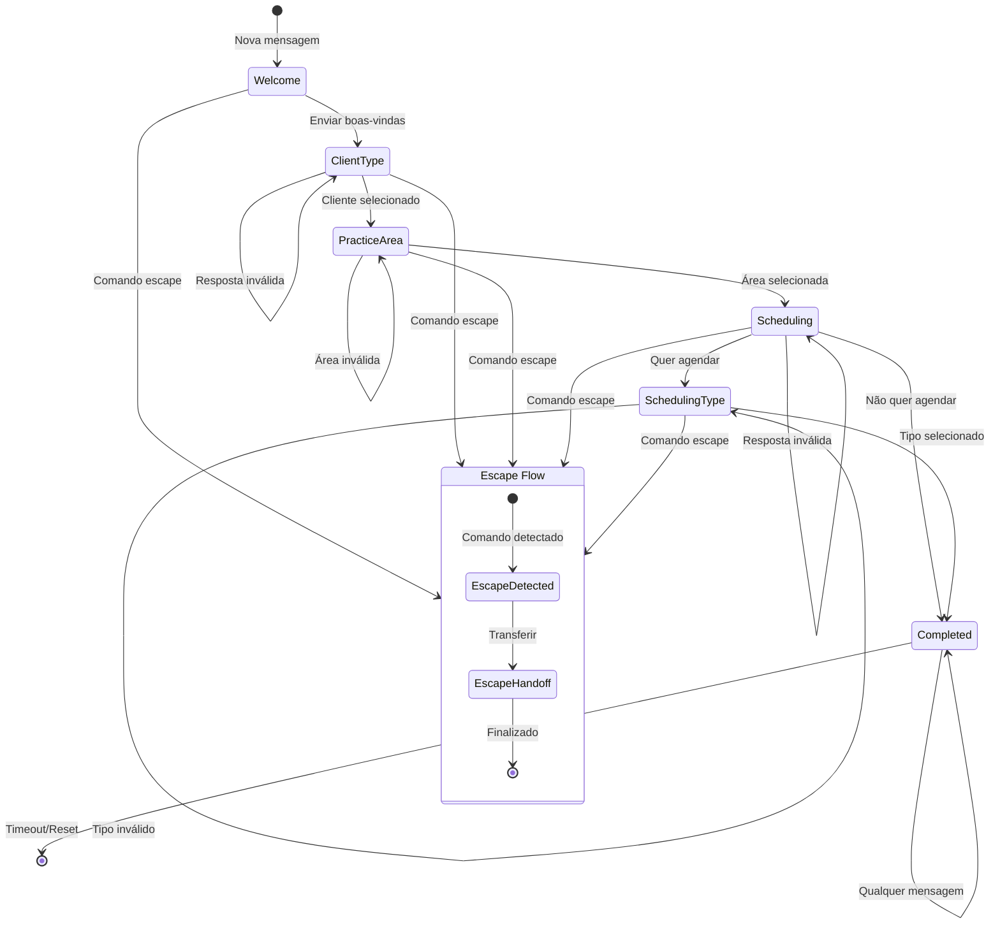
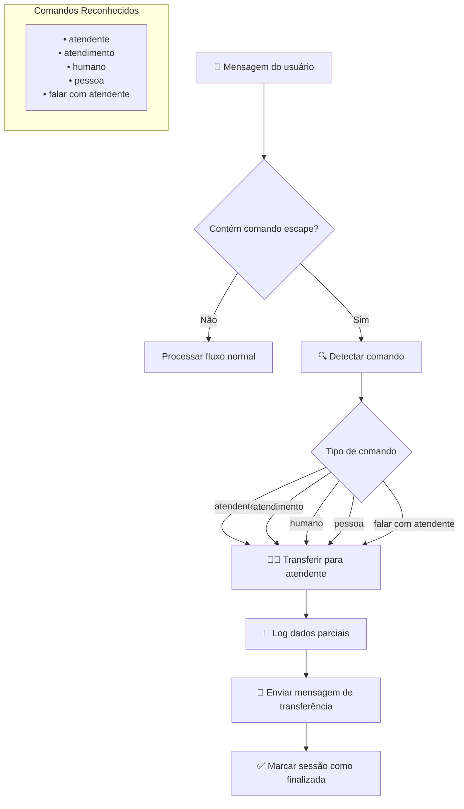
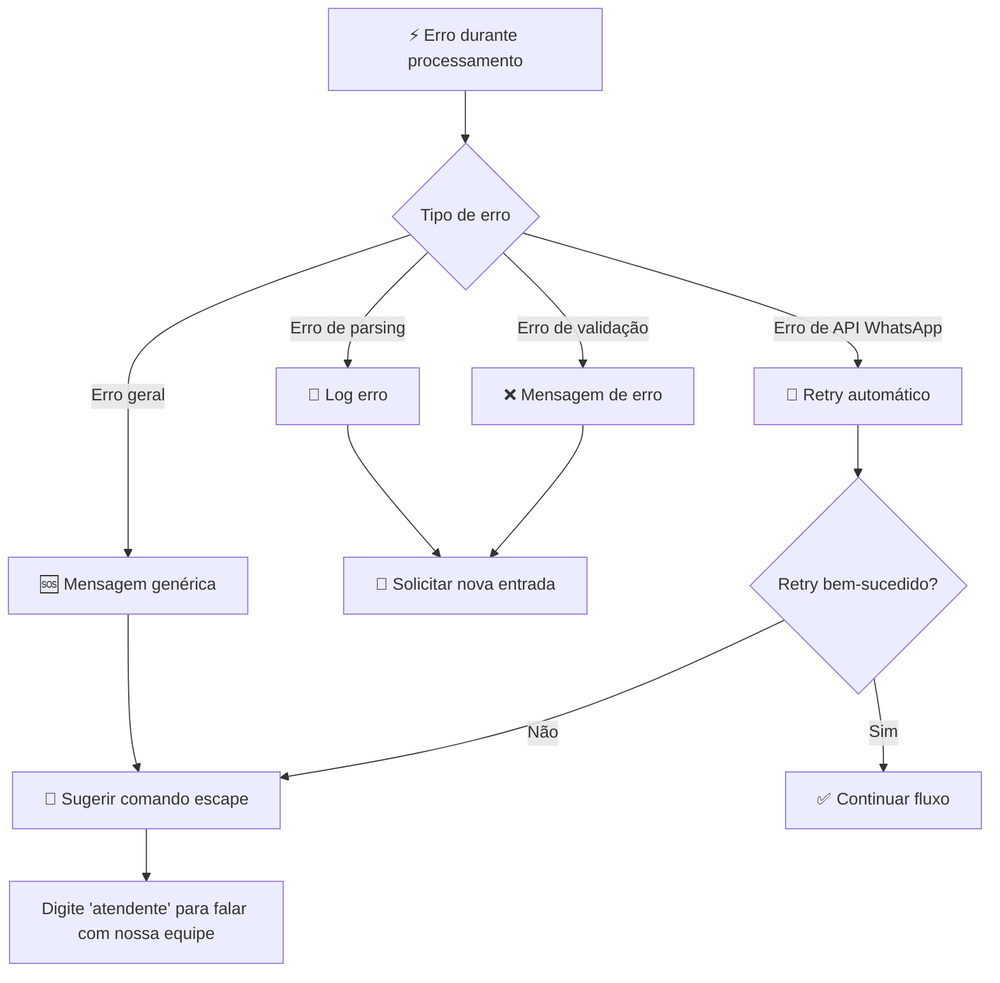

# Fluxos de Conversa - Advocacia Direta WhatsApp Bot

## Diagrama Principal do Fluxo de Conversa

```mermaid
flowchart TD
    A[📱 Usuário envia mensagem] --> B{Verificar comando de escape}
    
    B -->|atendente, humano, etc.| ESC[🔄 Comando de Escape]
    ESC --> ESC_MSG["Transferindo para atendimento humano..."]
    ESC_MSG --> END_ESC[✅ Sessão finalizada]
    
    B -->|Mensagem normal| C{Verificar sessão existente}
    
    C -->|Nova sessão| D[🆕 Criar nova sessão]
    C -->|Sessão existente| E[📋 Recuperar sessão]
    
    D --> WELCOME
    E --> F{Verificar step atual}
    
    F -->|welcome| WELCOME[👋 Boas-vindas]
    F -->|client_type| CLIENT[👤 Tipo de Cliente]
    F -->|practice_area| AREA[⚖️ Área Jurídica]
    F -->|scheduling| SCHED[📅 Agendamento]
    F -->|scheduling_type| TYPE[🏢 Tipo de Consulta]
    F -->|completed| COMP[✅ Finalizado]
    
    WELCOME --> WELCOME_MSG["Olá! Sou o assistente virtual da Advocacia Direta.<br/>Você é:"]
    WELCOME_MSG --> WELCOME_BTN["Já sou Cliente<br/>Primeira Consulta"]
    WELCOME_BTN --> CLIENT
    
    CLIENT --> CLIENT_CHECK{Validar resposta}
    CLIENT_CHECK -->|novo ou cliente_novo| CLIENT_NEW[✅ Cliente Novo registrado]
    CLIENT_CHECK -->|antigo ou cliente_antigo| CLIENT_OLD[✅ Cliente Antigo registrado]
    CLIENT_CHECK -->|Resposta inválida| CLIENT_ERROR["❌ Por favor, selecione uma das opções"]
    CLIENT_ERROR --> CLIENT
    
    CLIENT_NEW --> AREA_MSG["Qual área jurídica você precisa de ajuda?"]
    CLIENT_OLD --> AREA_MSG
    AREA_MSG --> AREA_BTN["🔘 Direito Civil<br/>🔘 Direito Trabalhista<br/>🔘 Direito Criminal"]
    AREA_BTN --> AREA
    
    AREA --> AREA_CHECK{Validar área}
    AREA_CHECK -->|civil ou direito_civil| AREA_CIVIL[✅ Direito Civil selecionado]
    AREA_CHECK -->|trabalhista ou direito_trabalhista| AREA_TRAB[✅ Direito Trabalhista selecionado]
    AREA_CHECK -->|criminal ou direito_criminal| AREA_CRIM[✅ Direito Criminal selecionado]
    AREA_CHECK -->|Resposta inválida| AREA_ERROR["❌ Por favor, selecione uma das áreas"]
    AREA_ERROR --> AREA
    
    AREA_CIVIL --> SCHED_MSG
    AREA_TRAB --> SCHED_MSG
    AREA_CRIM --> SCHED_MSG
    SCHED_MSG["Entendi! Você precisa de ajuda com [ÁREA].<br/>Gostaria de agendar uma consulta?"] --> SCHED_BTN["🔘 Sim, agendar<br/>🔘 Não, só informação"]
    SCHED_BTN --> SCHED
    
    SCHED --> SCHED_CHECK{Quer agendar?}
    SCHED_CHECK -->|sim ou agendar| SCHED_YES[✅ Agendamento solicitado]
    SCHED_CHECK -->|não ou nao| SCHED_NO[✅ Apenas informação]
    SCHED_CHECK -->|Resposta inválida| SCHED_ERROR["❌ Por favor, responda sobre agendamento"]
    SCHED_ERROR --> SCHED
    
    SCHED_YES --> TYPE_MSG["Perfeito! Como você prefere a consulta?"]
    TYPE_MSG --> TYPE_BTN["🔘 Presencial<br/>🔘 Online"]
    TYPE_BTN --> TYPE
    
    TYPE --> TYPE_CHECK{Validar tipo}
    TYPE_CHECK -->|presencial| TYPE_PRES[✅ Consulta Presencial]
    TYPE_CHECK -->|online| TYPE_ON[✅ Consulta Online]
    TYPE_CHECK -->|Resposta inválida| TYPE_ERROR["❌ Por favor, escolha Presencial ou Online"]
    TYPE_ERROR --> TYPE
    
    SCHED_NO --> COMPLETE
    TYPE_PRES --> COMPLETE
    TYPE_ON --> COMPLETE
    
    COMPLETE[📋 Compilar dados coletados]
    COMPLETE --> SUMMARY
    SUMMARY["✅ Informações coletadas:<br/>• Tipo: [CLIENTE]<br/>• Área: [ÁREA]<br/>• Agendamento: [TIPO/NÃO]"] --> HANDOFF
    HANDOFF["🎯 Nossa equipe entrará em contato em breve!"] --> LOG["📝 Log para equipe de recepção"]
    LOG --> COMP
    
    COMP --> COMP_CHECK{Nova mensagem?}
    COMP_CHECK -->|Qualquer mensagem| COMP_MSG["Sua solicitação já foi registrada!<br/>Para novo atendimento, digite 'novo'"]
    COMP_MSG --> COMP_CHECK
```



## Fluxo de Estados (State Machine)



## Fluxo de Dados Coletados

```mermaid
flowchart LR
    A[📱 Início da Conversa] --> B[👤 client_type]
    B --> C[⚖️ practice_area]
    C --> D{wants_scheduling?}
    
    D -->|Sim| E[🏢 scheduling_type]
    D -->|Não| F[📋 Dados Finais]
    E --> F
    
    F --> G[📤 Handoff para Equipe]
    
    subgraph "Dados Coletados"
        H[client_type: 'novo' | 'antigo']
        I[practice_area: 'Civil' | 'Trabalhista' | 'Criminal']
        J[wants_scheduling: true | false]
        K[scheduling_type: 'presencial' | 'online' | null]
    end
```

## Comandos de Escape



## Tratamento de Erros



## Resumo dos Estados

| Estado | Descrição | Próximo Estado | Dados Coletados |
|--------|-----------|----------------|-----------------|
| `welcome` | Boas-vindas iniciais | `client_type` | - |
| `client_type` | Seleção novo/antigo | `practice_area` | `client_type` |
| `practice_area` | Seleção da área jurídica | `scheduling` | `practice_area` |
| `scheduling` | Deseja agendar? | `scheduling_type` ou `completed` | `wants_scheduling` |
| `scheduling_type` | Tipo de consulta | `completed` | `scheduling_type` |
| `completed` | Conversa finalizada | `completed` | Todos os dados |

## Mensagens de Resposta

### Botões Interativos
- **Cliente**: "Cliente Novo" / "Cliente Antigo"
- **Área**: "Direito Civil" / "Direito Trabalhista" / "Direito Criminal"  
- **Agendamento**: "Sim, agendar" / "Não, só informação"
- **Tipo**: "Presencial" / "Online"

### Mensagens de Confirmação
- ✅ Dados coletados com sucesso
- 🎯 Handoff para equipe humana
- 🔄 Transferência por comando escape
- ❌ Validação de entrada inválida